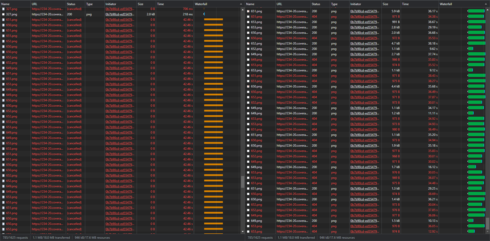
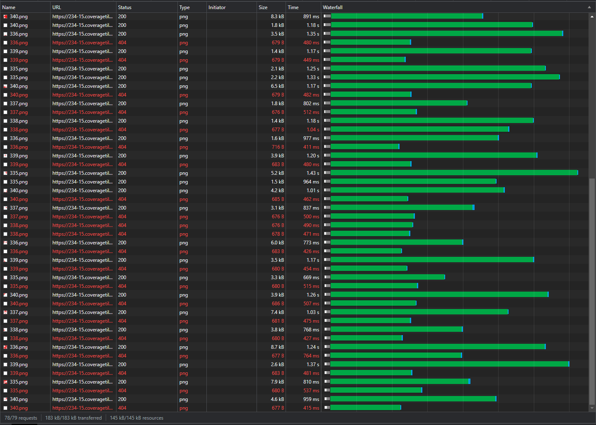
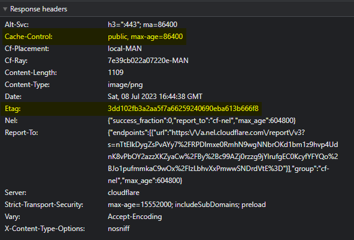
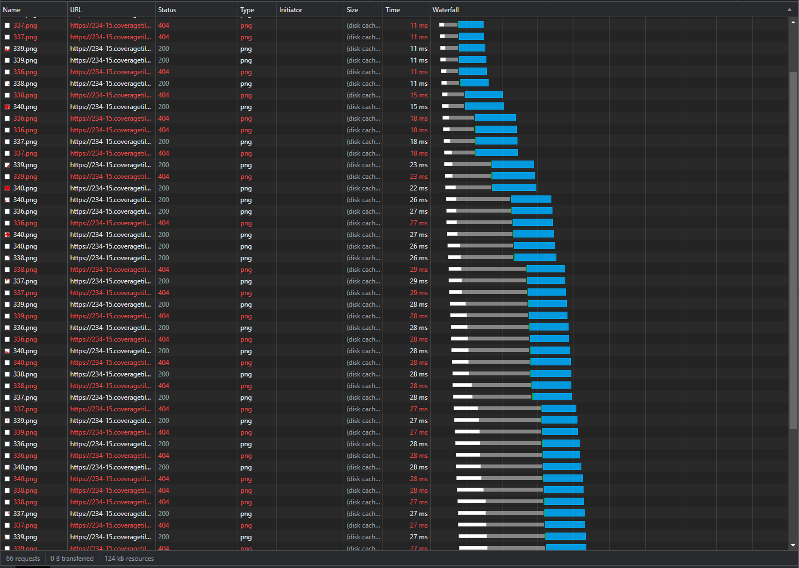
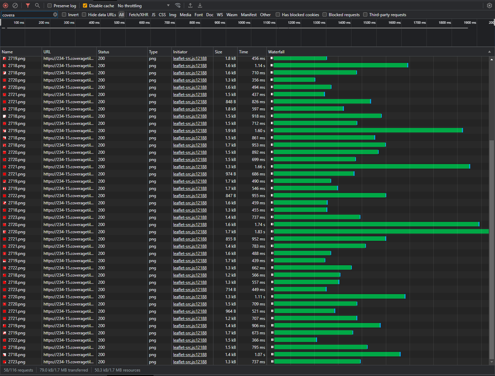
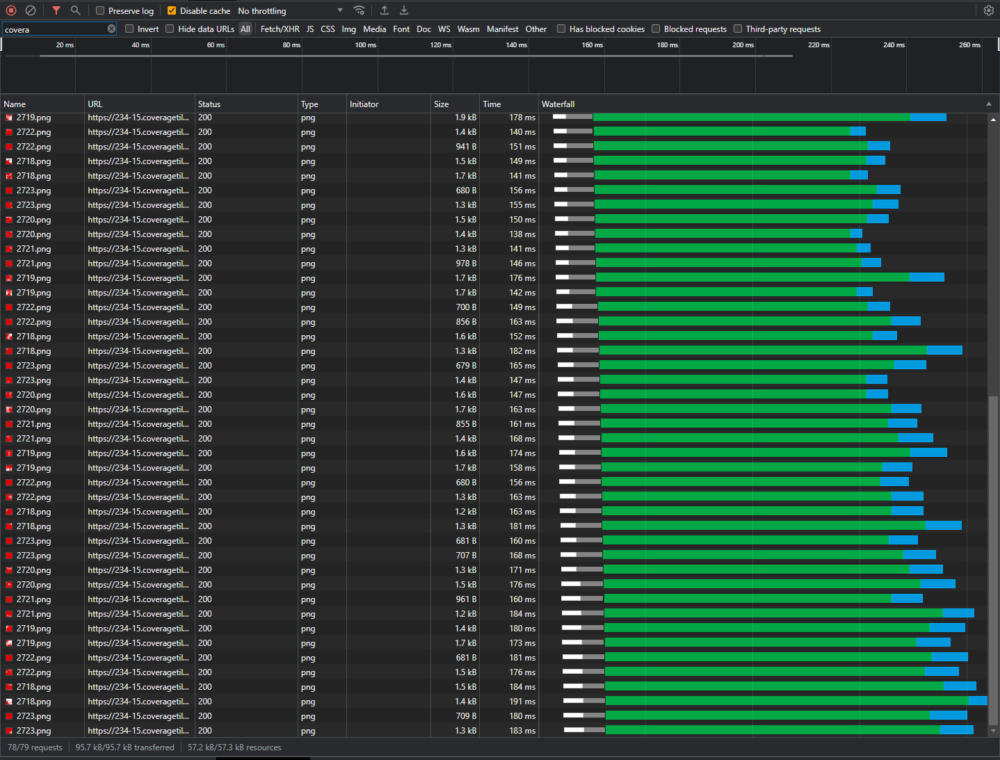

# Coverage Map Proxy Worker

A Cloudflare Workers project that proxies requests to my network coverage tiles on Backblaze B2.

## Purpose

This worker is designed to:

- act as a proxy between client requests from coverage map pages on [mastdatabase.co.uk](mastdatabase.co.uk) and the Backblaze B2 storage bucket that stores the actual tiles
- handle ETags and caching between clients and the worker
- gracefully handle malformed URIs and bucket downtime
- limit bandwidth fees from Backblaze B2 (Cloudflare traffic is free!)

## Why Cloudflare Workers

Initially, the coverage map utilised a self-hosted Nginx server on a Hetzner VPS, which served the tiles from a locally-mounted copy of the B2 bucket.

This had quite a few issues:

1. Sometimes the bucket would not automatically remount itself after a reboot of the VPS
2. Round-trip latency wasn't ideal between client -> German VPS -> Backblaze -> German VPS -> client
   - When loading a tile for the first time, it could sometimes take over 15 seconds, which is ridiculous
   - Using Cache Reserve meant significantly better performance after the first read, but read/write fees mean that the cost of this was $10/layer if someone decided to rip the tiles from my server
3. Why should I host this if someone else will do it cheaper or even free? 😅

## Migration

Migrating to Cloudflare Workers began with the new self-hosted Vodafone tiles at the start of July.

The other 3 networks will follow suit by the end of the month.

## Performance findings

Using the Vodafone layer, it has been possible to see remarkable performance improvements over my previous self-hosted system.

### Painful old tile hosting

The previous self-hosted rclone mount could take incredibly long amounts of time to fetch tiles. This would give an impression of a broken page or lack of detail.

Requests would often get stuck in the initial TCP/SSL handshake for 40s+ due to server performance. This likely could have been tweaked to increase parallel connection capability in hindsight.

Other times, users would encounted TTFB times of over 30s which is ridiculous.

### First load

For the first load of tiles, we see most requests completing within 1.5 seconds, with the average being about 1 second.

This isn't insanely fast, but considering the low cost nature of B2, and the fact that this is technically spawning two HTTP requests per client request (one HEAD to get the SHA1 from Backblaze B2, and another GET request to actually get the file contents), this seems very reasonable.

The 404s shown indicate that we have no coverage tile data for this section (aka, Vodafone don't have 5G coverage there). This is normal and expected behaviour. We don't respond with HTTP 200 with a blank tile because this method helps me to debug the difference between physically having no tile present in storage versus having a blank transparent tile in storage.

### Second load (local cache)

For successful requests (HTTP 200-299, as well as 404 for our purposes), we tell the browser to store a copy of the tile for one day, and we provide an ETag which can be used to revalidate the local cache without redownloading the entire tile again.

Loading the same map tiles as the last test, we can see the effect that local caching has within the first day because, well, it's local.

Tiles are all loaded within 30ms of the request being fired on my device. To a normal person, this is instant.

### Cache disabled on local device

Users won't always have tiles cached locally, and we don't want them to keep hitting the origin (B2) simply because that is a waste of time and bandwidth.

Within our worker, we instruct Cloudflare to cache any requests made back to B2 depending on the status code.

https://github.com/davwheat/coverage-map-proxy-worker/blob/d6f835f9ae62632f9783011389c39164b25fcc4c/src/worker.ts#L28-L31

This has the effect of speeding up tile requests for users who haven't already accessed the specific tile before.

The first screenshot shows the first cache-off load of a different part of the Vodafone 5G map, proceeded by the second screenshot showing the same segment being loaded again with cache disabled.

The second load times are all sub-200ms compared to the initial request duration of approximately 500ms to 1.5s. This is another significant improvement and even faster than the cache reserve system in place before.

The previous cache reserve system used before provides response times of between 100ms and 400ms depending on whether the tile was found in Cloudflare's edge cache or had to be fetched from the cache reserve.

## Overall findings

While the new system may not be faster under all circumstances, it is much more performant for most requests, and presents a significantly greater user experience overall.

My only remaining concern is hitting my maximum limit for bundled worker requests of 100,000 requests/day. It is likely I will need to upgrade to the $5/month tier, which is still good enough value for money for me.
